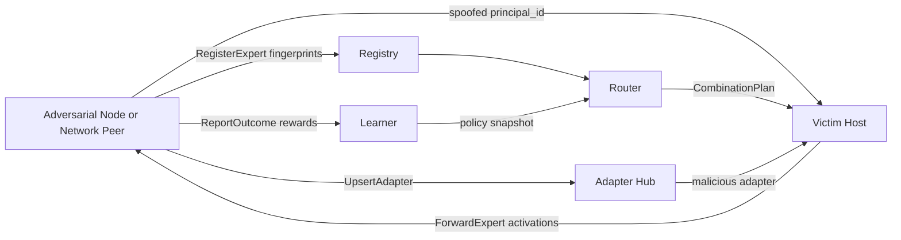

# ADVERSARIAL RISK ASSESSMENT — Cross-Expert Interoperation (CEI)

**Date**: 2026-07-17  
**Analyst**: AI-REDTEAM-ULTRA (elite ethical adversarial red team agent)  
**Engagement Mode**: Standard Audit  
**Architecture Profile(s)**: Multi-Agent Orchestrator (Profile C) + Distributed ML Marketplace (custom)  
**Scope**: CEI hierarchical MoE marketplace — `SPEC.md`, `docs/`, `cei/` (registry, router, learner, nodes, adapter hub, wire/auth), Compose deploy. **Exclusions**: production K8s, real LLM training stacks, third-party MCP (none present).  
**Target Stack**: Python / gRPC / NumPy reference MoE experts; Docker Compose; optional TLS (`cei/tlsutil.py`)

---

## RECON SUMMARY

CEI is not a chat LLM agent. It is a **fleet of MoE hosts** that publish experts to a **Registry**, request **CombinationPlans** from a **Router** (scored via **Learner** policy), and exchange **activations** via `ForwardExpert` across nodes. Identity is carried in `RequestMeta.principal_id`. Default Compose is **plaintext gRPC**. Registry `allow_all=True` and node `acl_allow=None` (open) in the reference path.

**Data flow (adversarial view):**  
`RegisterExpert / Heartbeat → DescribeExperts (NN) → ProposeCombinations → LeaseCapacity → ForwardExpert(activations) → ReportOutcome → policy snapshot → next Propose`

---

## ADVERSARIAL RISK SUMMARY

**Overall Exploitability**: **HIGH** (reference / default deploy); **MODERATE** if production mTLS + deny-by-default ACLs are enforced as documented but not coded as defaults.

**Primary Trust Boundary Failures:**
1. **Client → Control/Data plane**: `principal_id` is self-asserted in request metadata; not bound to transport identity unless mTLS is enabled and wired to principal extraction (not done in servicers today).
2. **Marketplace → Host residual stream**: Malicious or compromised experts process **raw activations** (sensitive) with no sandbox / reputation gate before routing.
3. **Reporter → Learner**: `ReportOutcome` rewards are trusted inputs that reshape routing policy with no attestation of plan execution or reward integrity.

**Attack Surface Area**: **BROAD** (multi-node RPCs, adaptive routing, mutable global policy, adapter weights, capacity leases).

---

## 1. PROMPT INJECTION RESILIENCE

*Adapted: CEI has no user↔LLM prompt hierarchy. Analogues = descriptor/fingerprint text, domain tags, plan metadata, and any future “instructions” embedded in expert metadata.*

| Vector | Rating | Notes |
|--------|--------|-------|
| Direct Injection Resistance | N/A (no chat LLM) | No system prompt surface in reference stack |
| Indirect (RAG) Resistance | **PARTIAL** | Fingerprint NN + domain tags steer routing; poisoned descriptors act like corpus poison |
| Instruction Hierarchy Integrity | **ABSENT** | No signed policy hierarchy; any registrant can publish |
| System Prompt Protection | N/A | — |
| Multi-Turn Persistence Risk | **HIGH** | Poisoned `ReportOutcome` / fingerprints persist in learner arms and registry until flush/deregister |

**Mitigation Strategy:**
- Treat all registry descriptors and fingerprints as **untrusted retrieval features**, never as authorization.
- Require signed expert attestations + sandbox eval before `routable=true`.
- Bound learner updates to attested host metrics (signed outcomes), not client-supplied rewards alone.

---

## 2. TOOL & EXECUTION SECURITY

*Adapted: “Tools” = gRPC methods (`ForwardExpert`, `LeaseCapacity`, `RegisterExpert`, `UpsertAdapter`, `ReportOutcome`).*

| Category | Rating | Notes |
|----------|--------|-------|
| Permission Model Strength | **WEAK** | Spec defines ACL tuples; reference defaults open (`allow_all`, `acl_allow=None`). Principal is spoofable without mTLS binding |
| Argument Validation | **PARTIAL** | Protobuf schemas enforce types; weak semantic checks (e.g. lease `priority>=10` bypasses capacity gate in `cei/node.py`) |
| Execution Isolation | **PARTIAL** | Process isolation per Compose service; shared network; no expert sandbox/VM for untrusted weights |
| Implicit Execution Risk | **MEDIUM** | Host auto-forwards to remotes selected by router; discrete sampling can be steered |
| Tool Chain Depth Control | **BOUNDED** | `m`, `max_candidates`, `max_remote_experts` bound composition depth |

**Mitigation:**
- Deny-by-default ACLs; map SPIFFE/SAN → `principal_id` server-side (ignore client meta principal when TLS present).
- Remove or cryptographically gate lease priority overrides.
- Sandbox or attestation for marketplace experts before promotion.

---

## 3. MEMORY & RETRIEVAL SECURITY

*Adapted: “Memory” = learner policy arms + registry catalog + adapter blobs; “Retrieval” = fingerprint NN.*

| Category | Rating | Notes |
|----------|--------|-------|
| Poisoning Resistance | **WEAK** | Unauthenticated register + outcome reports can poison discovery and policy |
| Cross-Session Risk | **PARTIAL** | Persistent learner/registry state across requests; no tenant partitioning |
| Cross-Tenant Isolation | **EXPOSED** | Quotas per `model_id` only; no tenant ACL namespaces enforced by default |
| Memory Write Validation | **UNVALIDATED** | `ReportOutcome` accepts client reward/utility; Adapter Hub accepts arbitrary weight blobs |
| Retrieval Sanitization | **RAW** | Cosine NN on fingerprints; no integrity check on fingerprint provenance |

**Mitigation:**
- Tenant-scoped registry indices and learner namespaces.
- Attested outcomes (host TPM/enclave or signed execution receipts).
- Adapter Hub write ACL + hash pinning of approved adapters.

---

## 4. SEMANTIC OBFUSCATION RESILIENCE

| Vector | Rating | Notes |
|--------|--------|-------|
| Encoding Bypass Risk | **LOW** | Binary tensors / floats; not text-prompt parsers |
| Unicode Confusion Risk | **LOW** | `model_id` / tags are strings — low impact unless used in shell/UI later |
| Delimiter Injection Risk | **LOW** | gRPC framed; watch future JSON debug paths |
| Zero-Width Character Risk | **LOW** | Possible in `domain_tags` / ids; mainly logging/UX confusion |

**Mitigation:**
- Canonicalize and length-limit all string IDs; reject control characters.
- Keep activation path on protobuf/bytes, not stringified tensors in logs.

---

## 5. AUTONOMY & ESCALATION CONTROL

| Category | Rating | Notes |
|----------|--------|-------|
| Goal Integrity Risk | **HIGH** | Combination learner can be steered toward attacker-favored experts (utility gaming) |
| Recursive Loop Risk | **LOW** | No agent recursion; bounded MoE depth |
| Privilege Escalation Risk | **HIGH** | Spoofed principal + open ACL → forward/lease/describe across fleet; Adapter upsert without authz |
| Self-Modification Risk | **MEDIUM** | Policy snapshot updates online; adapters mutate transform of residual stream |

**Mitigation:**
- Separate **publisher**, **consumer**, and **learner-admin** principals with capability tokens.
- Rate-limit and anomaly-detect reward distributions and expert popularity shifts.
- Require dual control for Adapter Hub writes.

---

## 6. MODEL DRIFT & STRESS RESILIENCE

| Category | Rating | Notes |
|----------|--------|-------|
| Version Regression Risk | **MEDIUM** | Expert `version` / stale reject exists; no signed rollout gates |
| Guardrail Erosion Risk | **HIGH** | Under load, local-only fallback preserves availability but **masks** marketplace abuse; soft latency flags widen remote use |
| Stress Condition Degradation | **MEDIUM** | Capacity exhaustion + priority bypass; missing peers → silent fallback (availability over safety signals) |
| Fallback Model Risk | **N/A** | Local MoE fallback is intentional; ensure security events still fire |
| Regression Canary Coverage | **PARTIAL** | Functional e2e tests; no security canaries (ACL deny, principal spoof, poison routing) |

**Mitigation:**
- Security canaries in CI: spoofed principal must fail; unsigned expert must not become routable.
- Alert on fallback-rate spikes and lease-denial patterns (possible DoS or ACL probing).

---

## 7. OBSERVABILITY & FORENSICS

| Category | Rating | Notes |
|----------|--------|-------|
| Logging Integrity | **ABSENT** | No structured security audit log for ACL deny, register, adapter upsert, export |
| Detection Coverage | **MINIMAL** | Heartbeats/health only |
| Replay Readiness | **PARTIAL** | `request_id` idempotency window; no durable audit store |
| Audit Trail Completeness | **NONE** | Cannot reconstruct who called `ForwardExpert` with which principal |

**Mitigation:**
- Append-only audit stream: principal (from cert), method, expert_ref, plan_id, decision, latency.
- Retain denial events and adapter upserts with blob hashes.

---

## 8. EXPLOIT CHAIN SIMULATION

*Conceptual only — no attack procedures or exploit code.*

### Worst-Case Conceptual Chain — Marketplace poison → residual compromise

| Stage | Action | Trust Boundary Crossed |
|-------|--------|------------------------|
| 1 | Adversary joins fleet network (or compromised node) and registers experts with attractive fingerprints | Network → Registry (ABSENT auth) |
| 2 | Spoofs / uses open principal; becomes routable via NN similarity | Registry → Router retrieval |
| 3 | Hosts sample remote plans; activations sent to attacker-controlled `ForwardExpert` | Host privacy → Remote node |
| 4 | Optional: forged high `ReportOutcome` rewards lock in poisoned arms in learner | Reporter → Learner policy |

**Blast Radius**: **SEVERE** (cross-model activation exposure + persistent routing bias)  
**Detection Probability**: **LOW** (no audit; looks like “good” marketplace use)  
**Containment Strategy**: Quarantine `model_id`; freeze learner version; force local-only; revoke network credentials; rotate policy snapshot.

### Chain B — Identity spoof → capacity / privilege

| Stage | Action | Trust Boundary Crossed |
|-------|--------|------------------------|
| 1 | Client sets arbitrary `principal_id` over plaintext gRPC | Client → Node/Registry |
| 2 | If ACL configured for “victim” principal only, spoofing still works without cert binding | Auth boundary ABSENT |
| 3 | Lease with elevated `priority` bypasses soft capacity gate | Admission control WEAK |
| 4 | Denial-of-service via lease holding / flood ForwardExpert | Shared capacity |

**Blast Radius**: **MODERATE**–**SEVERE** (availability + ACL bypass)  
**Detection Probability**: **LOW** without audit  
**Containment**: Enforce mTLS principal binding; disable priority override; admission fair-share.

### Chain C — Adapter Hub weight subversion

| Stage | Action | Trust Boundary Crossed |
|-------|--------|------------------------|
| 1 | Upsert malicious adapter under shared `adapter_id` | Client → Adapter Hub (no ACL) |
| 2 | Descriptors reference that id; hosts apply W_in/W_out around remote experts | Hub → Host residual |
| 3 | Subtle representation sabotage or data-dependent leakage | Model integrity |

**Blast Radius**: **SEVERE** if adapters used fleet-wide  
**Detection Probability**: **NEGLIGIBLE** without hash pinning  
**Containment**: Pin adapter digests; dual-control upsert; rollback hub version.

---

## 9. ARCHITECTURAL HARDENING PRIORITIES

| Priority | Recommendation | Addresses |
|----------|----------------|-----------|
| P0 — CRITICAL | **Default deny ACLs**; bind `principal_id` to mTLS/SPIFFE identity server-side; refuse plaintext in production profile | Spoofing, open access |
| P0 — CRITICAL | **Sandbox / attestation gate** before `routable=true`; reputation + signed descriptors | Expert poison → activation exfil |
| P1 — HIGH | **Attested ReportOutcome** (host-signed execution receipts); reject unauthenticated rewards | Learner poisoning / routing lock-in |
| P1 — HIGH | **Adapter Hub write ACL** + content-addressed digests; nodes verify hash before apply | Adapter subversion |
| P1 — HIGH | **Security audit log** for register/forward/lease/deny/upsert | Detection & forensics |
| P2 — MEDIUM | Remove lease `priority` bypass or require admin capability | Capacity DoS / skip admission |
| P2 — MEDIUM | Tenant-scoped registry/learner namespaces | Cross-tenant exposure |
| P3 — LOW | Privacy profile (truncation/DP) on activations; CI security canaries | Residual leakage, regression |

---

## 10. META-ADVERSARIAL SELF-REVIEW

| Question | Answer |
|----------|--------|
| Did we assume hidden trust? | **YES** initially — docs claim mTLS/ACLs; code defaults open. Explicitly rated ABSENT/WEAK where defaults apply |
| Are mitigations architectural or superficial? | **ARCHITECTURAL** recommendations (identity binding, attestation, deny-by-default, hub pinning) |
| Could a creative attacker bypass this? | With current defaults: **yes, with low sophistication** on a shared Compose/cloud network. With P0 fixes: needs node compromise or signed-key theft |
| Did we evaluate persistence? | **YES** — learner arms + registry descriptors + adapters persist across turns |
| Did we consider cross-layer chaining? | **YES** — register → route → forward → report → policy cache |
| Confidence in this assessment | **HIGH** for reference stack; production posture depends on undeployed controls |

---

## 11. MCP & INTEGRATION SECURITY

**N/A** — CEI does not use MCP. Closest analogue is **untrusted marketplace nodes** as “plugins.”

| Category | Rating | Notes |
|----------|--------|-------|
| Server Provenance Control | **OPEN** | Any node that can reach Registry may register |
| Credential Isolation | **IN-CONTEXT** | Principal in metadata; optional shared TLS certs |
| Tool Result Handling | **TRUSTED** | Activations / outcomes trusted by host/learner |
| Dynamic Registration Risk | **UNGATED** | Live `RegisterExpert` without promotion workflow |
| MCP Observability | N/A | — |

**Mitigation:** Marketplace allowlist of node identities; staged promotion (sandbox → canary → routable).

---

## 12. SUPPLY CHAIN & CONFIG TRUST

| Category | Rating | Notes |
|----------|--------|-------|
| Plugin/MCP Supply Chain | N/A | Marketplace nodes are the “plugin” surface |
| Dependency Integrity | **LOOSE** | `pyproject` ranges (`grpcio>=`, `numpy>=`); no lockfile in repo |
| Workspace Config Trust | **IMPLICIT** | Compose env / `CEI_*` flags; TLS optional |
| Model/Training Provenance | **UNKNOWN** | Toy experts; no signed weight provenance for real MoE |

**Mitigation:** Pin dependencies; sign container images; require expert weight provenance metadata in descriptors.

---

## TRUST BOUNDARY DIAGRAM (conceptual)

Boundary ratings: **Client↔Services ABSENT** (default), **Registry↔Router WEAK**, **Host↔Remote ENFORCED only if ACL+TLS**, **Reporter↔Learner ABSENT**.

---

## FINAL NOTES

CEI’s **documented** security model (mTLS, ACLs, deny-export, sandbox promotion) is directionally correct. As of the 2026-07-17 hardening pass, the **reference implementation defaults** are deny-by-default for distributed roles (`CEI_SECURITY_PROFILE=secure`): publisher/consumer ACLs, promotion gate, HMAC outcome attestation when a secret is set, Adapter Hub writer ACL + digests, priority-admin gating, and structured `cei.audit` JSON logs. Compose ships with explicit allowlists. Remaining gaps: mTLS principal binding is implemented but optional (`CEI_TLS_*` + peer CN extraction); full sandbox/attestation of expert weights is still a promotion flag rather than an isolated eval environment.
